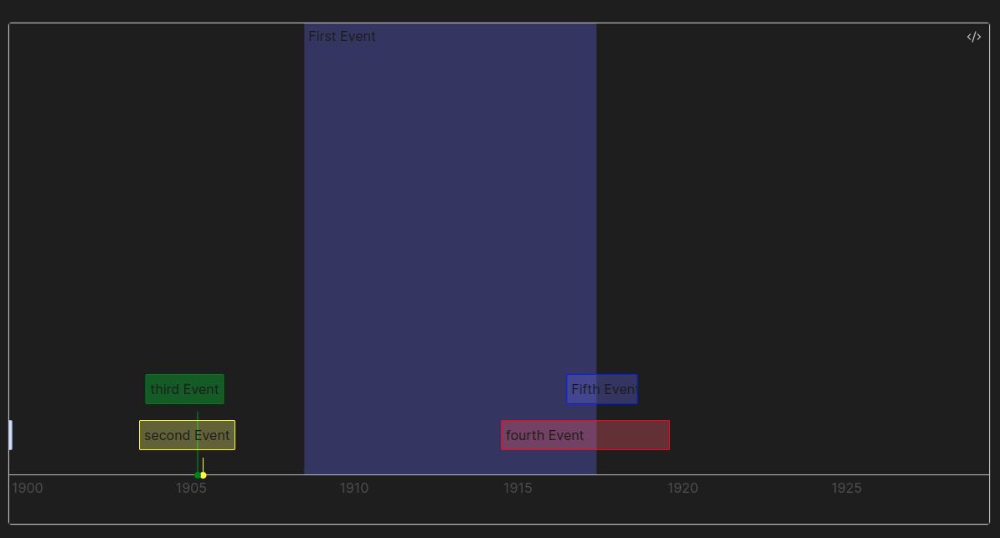
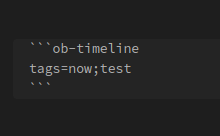
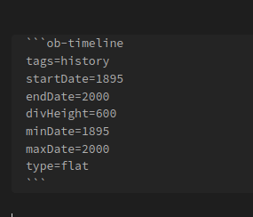

<!--  -->


## First Things First
This is an updated fork of Darakah's famous [obsidian-timelines](https://www.github.com/Darakah/obsidian-timelines) plugin for the [Obsidian](https://www.obsidian.md) notes app. Based on what I've seen, there were numerous reports of bugs in the code, documentation was either lacking or frankly just confusing and it's been overall worked on irregularly. This fork, **Timelines (Revamped)**, aims to fix some of those problems.

But, credit should be placed where credit is due. Kudos to Darakah for his amazing work on the original version of this plugin. I've learned a lot just combing through the code as I was doing my refactors.

<br>

Below, I've edited the original README primarily to add clarity, but also to highlight some changes I've made to functionality, and add some additional example images.

<br>

# Timelines (Revamped)

Generate a chronological timeline in which all "events" are notes that include a specific tag or set of tags.

## Examples



<h2 style="padding-top: 525px"> Inserting a Timeline </h2>

Rendering a timeline requires a couple *separate* pieces, the main two are:
1. a note or notes with events specified by a `div` or a `span` HTML element, and
2. a `ob-timeline` code block or a timeline HTML comment in the note you wish to display the timeline in.

### Using a Timeline codeblock for dynamic rendering

Add the following codeblock in the note where you'd like to render a timeline:



The render block takes a single line which is the _list of tags_ (separated by semicolons) by which to filter timeline-tagged notes. For example, in the above example block, ONLY notes with all three tags (`timeline`, `test` and `now`) will be rendered.

You can display a horizontal timeline by building your codeblock like so:



Breaking down the filters:
- `tags` are the tags you want displayed on your timeline, 
- `startDate`: where you want your timeline to initially start displaying
- `endDate`: where you initially want your timeline to end
- `divHeight`: how tall you would like the timeline to be
- `minDate`: minimum end-cap to prevent scrolling or viewing before this date
- `maxDate`: maximum end-cap to prevent scrolling or viewing after this date

### Using an HTML code block for static rendering

Insert the following HTML comment where a statically rendered timeline should be inserted:

```html
<!--TIMELINE BEGIN tags='test;now'-->

<!--TIMELINE END-->
```

Use the `Timelines: Render Static Timeline` command to generate a static timeline. The command will generate static HTML and populate it between the HTML comments (BEGIN/END).

Running the command again will replace everything in between the comments with a freshly rendered timeline.

Timeline event changes will not be detected using this method, but as it is creating static HTML, the generated content will be readable without Obsidian (on GitHub, via Obsidian publish, etc.).

## Tagging a note for a Timeline

For a note to be included in a timeline, the following must be valid:

1. The `timeline` tag must be included in that note. You can put the tags in your front matter, or in a #tag somewhere in the note body.

```
---
tags: [timeline, test, me, now]
---
```

2. The note must have all the specified tags to be included in the search. The front matter example above will be included in all of the following searches for any events within the note body: `test`, `test;me`, `test;me;now`, `me;now`, `test;now`

3. The note must contain at least one timeline `span` or `div` element containing the event information, see the next section.

When generating a timeline, a note will be ignored in the following cases:
- The note does not have the `timeline` tag (the tag specified in plugin settings)
- The note does not contain all the tags from the search list
- The note does not contain any valid timeline span/div elements

## Timeline Event Properties

Timeline events must specify the following: 
- a valid date, YEAR-MONTH-DAY-MINUTES (check info section below for more details)
- a valid class, specifically `ob-timelines` must be specified.

All other fields are optional.

Invalid timeline events will be skipped.

### Timeline Entries (span/div)

A timeline entry can be created using a `<span></span>` or `<div></div>` HTML element, with the following attributes: 

```html
<span
  class='ob-timelines'
  data-start-date='2000-10-10-00'
  data-title='Time Period Event'
  data-class='orange'
  data-img='absolute/path/to/image.png'
  data-type='background'
  data-end-date='2000-10-20-00'
>
	Some Time Period that only lasted 10 days
</span>

<div
  class='ob-timelines'
  data-start-date='2000-10-11-00'
  data-title='Another Event'
  data-type='range'
  data-end-date='2000-10-12-00'
>
	A minimal event
</div>
```

### Customization

Timeline span and div entries (.ob-timelines class) are hidden in preview by default, however, if you wish to display content, try a snippet like this: 

```css
/* Render the ob-timelines span or div elements as inline blocks that use an italic font */
.ob-timelines {
  display: inline-block !important;
  font-style: italic;
}
/* Use the before pseudo element to display attributes of the span or div */
.ob-timelines::before {
  content: "🔖 " attr(data-start-date) ": " attr(data-title) ".";
  color: lilac;
  font-weight: 500;
}
```

Using the above snippet, a span like this: 

```html
<span class='ob-timelines' data-start-date='1499-03-28-00' data-title="An example"></span>
```

would be rendered as: 


### Arguments

#### Dates (`data-start-date` and `data-end-date`):

The most important and essential info for the timeline entry is the **date**. Timeline entries can be used for fantasy timelines, leading to a simplified set of rules for valid dates.

A valid date is specified as `YEAR-MONTH-DAY-HOUR`.

- All four segments must be present.
- Each segment can contain only numbers, but can be any length.
- The YEAR (first segment) can be negative: `-123-45-678-9` is a valid date.

Rightmost-segments containing only zeros will be omitted when the timeline is generated, for example: 

- `2300-02-00-00` will display as `2300-02`
- `2300-00-00-00` will display as `2300`

##### Event Sorting

Event sorting is performed by converting the date into a number. For fantasy calendars, you may need to pad months, days, or hours with zeros to ensure sorting works properly. 

- `2300-02-00-00` is sorted as `2300020000`
- `-234-02-00-00` is sorted as `-234020000`

For statically generated timelines, events that occur at the same time are grouped, and are either prepended or appended to a list based on your timeline sorting preference.

#### Title (`data-title`):
  - Optional
  - If a title is not specified, the name of the note will be used

#### Background Image (`data-img`):
  - Optional
  - If an image is not specified, no image will be shown (just text)
  - If an invalid url is given, an empty black section will be seen for that note card

Note: Currently only assets specified via `http` or `absolute local path` will render. Obsidian release `v0.10.13` blocked obsidian links for background images. 

#### CSS Class (`data-class`):
  - Optional
  - Adds the applied css class to the note card associated with the timeline entry

Note: Acceptable values for `data-class` are `orange`, `yellow`, `red`, `blue`, `green`, and `purple`. If the value is not supplied, events will be colored white (or grey for background events) on the timeline.

#### Type (`data-type`):
  - Optional
  - Tells the timeline what type of event to display for this entry.

Note: Acceptable values for `data-type` are:
  - `background`, best used for time periods
  - `box`
  - `point`, which is exactly what it sounds like, and
  - `range`

## Release Notes

### v0.1.0 (legacy v0.3.3)
- refactored most of the plugin. 
  - Introduced additional type checking and assertions. 
  - Broke up functionality into smaller functions for better readability and maintenance.
- updated readme to include better examples and instructions for creating and rendering a timeline.
- audited and updated package dependencies for security vulnerabilities
- updated to latest obsidian package

## License

Licensed under the MIT License.

## Support

Please feel free to open issues for any bugs or requests for additional functionality. Pull Requests are always welcome!

<!-- [](https://github.com/sponsors/Darakah) [](https://www.buymeacoffee.com/darakah) -->
