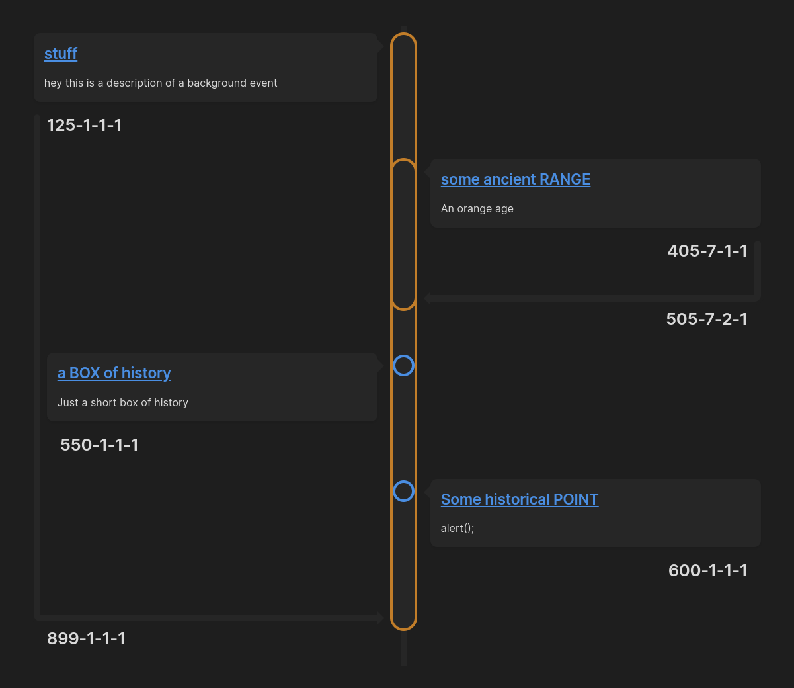

# Timelines (Revamped)

Generate a chronological timeline in which all "events" are notes that include a specific tag or set of tags.

See the changelog from the last major update to view any breaking changes [here](./changelog.md#v200).

> First time users may find this [video tutorial](https://www.youtube.com/watch?v=4SQWnjniQAE) helpful.

You can check out the docs for **Timelines (Revamped)** [here](https://seanlowe.github.io/obsidian-timelines). If there are any problems, don't hesitate to create a new issue and point it out. Thanks!

## Release Notes

### v2.3.2

Bug Fix for: `[Bug - Vertical] Sections of the date are visible when not provided` [#86](https://github.com/seanlowe/obsidian-timelines/issues/86)

**Changes:**
- revamped the date functionality so that users can pass date string sections as 0 or choose not pass them at all to keep them from rendering on the timeline
- removed some unnecessary functions and types in cleanup
- updated the docs on HTML event arguments to portray the new functionality

See the [changelog](./changelog.md) for more details on previous releases.

## Contributors

Thanks to all the contributors so far, on this iteration and the original:

## License

Licensed under the MIT License.

## Support

Please feel free to open issues for any bugs or requests for additional functionality. Pull Requests are always welcome!
