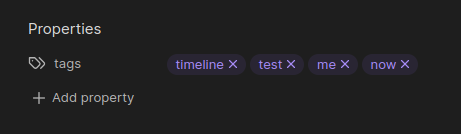

<!--  -->


## First Things First
This is an updated fork of Darakah's famous [obsidian-timelines](https://www.github.com/Darakah/obsidian-timelines) plugin for the [Obsidian](https://www.obsidian.md) notes app. Based on what I've seen, there were numerous reports of bugs in the code, documentation was either lacking or frankly just confusing and it's been overall worked on irregularly. This fork, **Timelines (Revamped)**, aims to fix some of those problems.

But, credit should be placed where credit is due. Kudos to [Darakah](https://github.com/Darakah) for his amazing work on the original version of this plugin. I've learned a lot just combing through the code as I was doing my refactors.

Also kudos to everyone who contributed to the original plugin, especially:
- [Erin Schnabel](https://github.com/ebullient),
- [ReconVirus](https://github.com/ReconVirus),
- [Ethan Miller](https://github.com/ethanimproving), and
- [Travis Mosley](https://github.com/tlm2021)

<br>

Below, I've edited the original README primarily to add clarity, but also to highlight some changes I've made to functionality, and add some additional example images.

Please read all the way through, things have diverged from Darakah's original plugin and they won't work the same way.

Thanks!

<br>

# Timelines (Revamped)

Generate a chronological timeline in which all "events" are notes that include a specific tag or set of tags.

See the changelog from the last major update to view any breaking changes [here](./changelog.md#v200).

## Examples

<br>


## Inserting a Timeline

Rendering a timeline requires a couple *separate* pieces, the main two are:
1. "events" within a note, which can be specified by:
    - a `div` or a `span` HTML element, or
    - keys in the front matter to use the entire file as an "event", and
2. a `ob-timeline` code block or a timeline HTML comment in the note you wish to display the timeline in.

### Using a Timeline codeblock for dynamic rendering

Add the following codeblock in the note where you'd like to render a timeline:


The render block takes a single line which is the _list of tags_ (separated by semicolons) by which to filter timeline-tagged notes. For example, in the above example block, **<u>only notes with all</u>** three tags (`timeline`, `test` and `now`) will be rendered.

You can display a horizontal timeline by building your codeblock like so:


Breaking down the filters:
- `tags`: the tags you want displayed on your timeline
- `startDate`: where you want your timeline to initially start displaying
- `endDate`: where you initially want your timeline to end
- `divHeight`: how tall you would like the timeline to be
- `minDate`: minimum end-cap to prevent scrolling or viewing before this date
- `maxDate`: maximum end-cap to prevent scrolling or viewing after this date
- `zoomInLimit`: the furthest in you will be able to zoom. See below for acceptable values
- `zoomOutLimit`: the furthest out you will be able to zoom
- `type`: horizontal-specific key. Pass `flat` in order to render a horizontal timeline

Acceptable values for filters:
- `zoomInLimit`:
  - You can either use the built-in timescales, or you can provide a value (in milliseconds) manually. Acceptable values are `day`, `week`, `month-detail`, `month-vague`, and `year`. Do not include to have no restrictions on zooming in (default behaviour).
    - `day` zooms down to one day, but still shows hours
    - `week` zooms down to about a week and shows the days of that week
    - `month-detail` zooms down to about a month and shows each of the days
    - `month-vague` zooms down to about a month but does not show the days
    - `year` zooms down to about a year and shows each of the months
- `zoomOutLimit`:
  - requires a time, in milliseconds. One year is around `32140800000`, the default value is `315360000000000`, which is about 10,000 years

<br>

> **Note:** the codeblock uses the key `ob-timeline` so that there is no conflict with other timeline plugins, specifically George-debug's Timeline [plugin](https://github.com/George-debug/obsidian-timeline).

### Using an HTML code block for static rendering

Insert the following HTML comment where a statically rendered timeline should be inserted:

```html
<!--TIMELINE BEGIN tags='test;now'-->

<!--TIMELINE END-->
```

Use the `Render static timeline` command to generate a static timeline. The command will generate static HTML and populate it between the HTML comments (BEGIN/END).

Running the command again will replace everything in between the comments with a freshly rendered timeline.

Timeline event changes will not be detected using this method, but as it is creating static HTML, the generated content will be readable without Obsidian (on GitHub, via Obsidian publish, etc.).

## Tagging a note for a Timeline

There are 2 ways to include a note in a timeline: **Frontmatter** or **HTML tags**. If HTML tags are included in the note, they will be used. Otherwise, the timeline will default to gathering data from the frontmatter. See [Timeline Entries](#timeline-entries) for more information on how to create events. This section is for overarching information on how a note is considered valid.

For a note to be included in a timeline, the following must be valid:

1. The `timeline` tag must be included in that note. You can put the tags in your front matter, or in a `#tag` somewhere in the note body.

```
---
tags: [timeline, test, me, now]
---
```

This also works natively with Obsidian's Properties update:



2. The note must have all the specified tags to be included in the search. The front matter example above will be included in all of the following searches for any events within the note body: `test`, `test;me`, `test;me;now`, `me;now`, `test;now`

3. The note must contain either the appropriate frontmatter keys or at least one timeline `span` or `div` element containing the event information, see the next section.

When generating a timeline, a note will be ignored in the following cases:
- The note does not have the `timeline` tag (the tag specified in plugin settings)
- The note does not contain all the tags from the search list
- The note does not contain any valid timeline span/div elements

## Timeline Event Properties

Timeline events must specify the following: 
- a valid date, YEAR-MONTH-DAY-HOUR (check info section below for more details)
- a valid class, specifically `ob-timelines` must be specified.

All other fields are optional.

Invalid timeline events will be skipped.

### Timeline Entries

#### Method 1: Frontmatter

```
---
start-date: 2010-06-34
end-date: 2020-01-12
title: A Time Range
type: range
color: blue
tags: [timeline, history]
---
```

Key specific notes:
- if a `title` key is not provided, it will use the name of the note by default.
- `color` supports the same values as listed below under the **Node Color (`data-color`)** argument block.
- `type` supports the same values as listed below under the **Type (`data-type`)** argument block.
- `start-date`, `end-date`, and `title` may all be customized to match other installed plugins that use tags such as FC-Calendar or Digital Garden within settings. It will default to the keys listed but will search in order of specification should the user wish to add values. Multiple values are also accepted when comma-separated. 

#### Method 2: HTML

A timeline entry can be created using a `<span></span>` or `<div></div>` HTML element, with the following attributes: 

```html
<span
  class='ob-timelines'
  data-start-date='2000-10-10-00'
  data-end-date='2000-10-20-00'
  data-title='Time Period Event'
  data-color='orange'
  data-img='absolute/path/to/image.png'
  data-type='background'
>
	Some Time Period that only lasted 10 days
</span>

<div
  class='ob-timelines'
  data-start-date='2000-10-11-00'
  data-end-date='2000-10-12-00'
  data-title='Another Event'
  data-type='range'
>
	A minimal event
</div>
```

There are multiple ways to insert an event. Of course, you can do it manually, but there also exist two additional ways to quickly insert an event into your note (at your current mouse position):

  1. Click the `</>` button on the ribbon
  2. Open the command palette and run the `Insert timeline event`.

Both of these will insert a new event `div` or `span` (it uses whichever value you've set in Settings but defaults to `div`) with all `data-*` attributes present but empty. Delete what you don't need, fill in what you want. 

> **Note:** There is also a ribbon icon and a command for inserting frontmatter into the current note.

### Customization

Timeline span and div entries (.ob-timelines class) are hidden in preview by default, however, if you wish to display content, try a snippet like this: 

```css
/* Render the ob-timelines span or div elements as inline blocks that use an italic font */
.ob-timelines {
  display: inline-block !important;
  font-style: italic;
}
/* Use the before pseudo element to display attributes of the span or div */
.ob-timelines::before {
  content: "🔖 " attr(data-start-date) ": " attr(data-title) ".";
  color: lilac;
  font-weight: 500;
}
```

Using the above snippet, a span like this: 

```html
<span
  class='ob-timelines'
  data-start-date='1499-03-28-00'
  data-title="An example">
</span>
```

would be rendered as: 


in Live Preview mode. I've noticed that using a `span` in Reading Mode or when viewing a `span` event in an Popover tends to render incorrectly. If proper rendering is a must-have, I recommend using a `div` for your events.

### Arguments

#### Dates (`data-start-date` and `data-end-date`):

The most important and essential info for the timeline entry is the **date**. Timeline entries can be used for fantasy timelines, leading to a simplified set of rules for valid dates.

A valid date is specified as `YEAR-MONTH-DAY-HOUR`.

- All four segments must be present.
- Each segment can contain only numbers, but can be any length.
- The YEAR (first segment) can be negative: `-123-45-678-9` is a valid date.

Rightmost-segments containing only zeros will be omitted when the timeline is generated, for example: 

- `2300-02-00-00` will display as `2300-02`
- `2300-00-00-00` will display as `2300`

Any included Month/Day sections of a date must be non-zero (for the time being) in order for the date to properly parse and be included on the timeline. 

For example: `2300-02-00-00` should actually be passed in as: `2300-02` if you don't care about the day, or `2300-02-01` if you mean that it began at the beginning of the month. The last section of a date (the time), however, can be zero if you want. Any section that is not passed in will be added internally with the valid minimal value (`01` for months and days, and `00` for time.)

Date normalization is handled according to the next section **Event Sorting**, so that dates -- even fantasy ones -- are sorted in the order specified. Although, there are some ... *intricacies*, when dealing with odd fantasy dates with the horizontal timeline simply due to the library used to generate the timeline. I'm looking into better solutions for this.

##### Event Sorting

Event sorting is performed by padding all sections of the date with leading zeros so that all sections are the same length. The resulting string is compared directly against other strings. The length to which sections will be padded is controlled by the `Maximum padding on dates` value in the settings tab.

For example, for these two dates with a max padding value of `4`:
- `2300-02-01-00` would be padded and sorted as ` 2300-0002-0001-0000`, whereas
- `-234-02-01-00` would be padded and sorted as `-0234-0002-0001-0000`.

We can now see how simple it is to have any kind of calendar you want (fantasy or otherwise) and have it sort the way you'd like. Any missing sections will be automatically populated for you, with missing months and day values being set to `01` and the time value being set to `00`.

Here's what that looks like with a max padding of `4`:
- `9991-3-477-9817` would become `9991-0003-0477-9817`,
- `1984` would become `1984-0001-0001-0000`
- `-33-777` would become `-0033-0777-0001-0000`

For statically generated timelines, events that occur at the same time are grouped, and are either prepended or appended to a list based on your timeline sorting preference.

#### Title (`data-title`):
  - Optional
  - If a title is not specified, the name of the note will be used

#### Background Image (`data-img`):
  - Optional
  - If an image is not specified, no image will be shown (just text)
  - If an invalid url is given, an empty black section will be seen for that note card

Note: Currently only assets specified via `http` or `absolute local path` will render. Obsidian release `v0.10.13` blocked obsidian links for background images. 

#### Era (`data-era`):
  - Optional
  - Adds this text to the date span in the timeline as an era designation. Useful for fictional calendars.
  - Applied after the date is formatted. So `2300` with the era set to `AB` would display `2300 AB`.

#### Node Color (`data-color`):
  - Optional
  - Tells the timeline to color that entry in the color provided.
  - Supports hex color codes and color names, such as `blue`, `red`, `rebeccapurple`, `#96F613`, or `FF7F50`

Note: If a value is not supplied, events will be colored `white` (or `gray` for background events) on the timeline.

#### Type (`data-type`):
  - Optional
  - Tells the timeline what type of event to display for this entry.

Note: Acceptable values for `data-type` are:
  - `background`, best used for time periods
  - `box`
  - `point`, which is exactly what it sounds like, and
  - `range`

#### Path (`data-path`):
  - Optional
  - An alternate path to link the title to (excluding `[[` and `]]`). Default to the note the event is defined in, but you can use this to specify other notes or link to headers or blocks internally within the note. For example, `data-path='My Note#Event Subhead'` would link directly to the `Event Subhead` header in `My Note`
  - If you use the "Page preview" plugin, this contents of this header will display when hovering over the title. Useful for quickly viewing expanded details without leaving the current timeline.

#### Tags (`data-tags`):
  - Optional
  - An override to the tags that the event should be counted with. Allows you to have a note with events on separate timelines. For example, 1 event has tag "A" and a second has tag "B". A combined timeline will display both, but now you can also have 2 separate timelines where only the applicable ("A" or "B") events will be displayed.
  - Values are a string of tags separated by semicolons, similar to the tags list on either of the codeblocks for displaying timelines. Ex: `data-tags="timeline-A;timeline-B"`

## Release Notes

### v2.1.6

Bug fix for Issue [seanlowe/obsidian-timelines#39](https://github.com/seanlowe/obsidian-timelines/issues/39)

**Changes:**
- fixed incorrect rendering of events with hours specified. Hours will now shift the event as expected
- fixed an issue where notes would not be added to the timeline due to tags not having `#` removed

See the [changelog](./changelog.md) for more details on previous releases.

## License

Licensed under the MIT License.

## Support

Please feel free to open issues for any bugs or requests for additional functionality. Pull Requests are always welcome!
